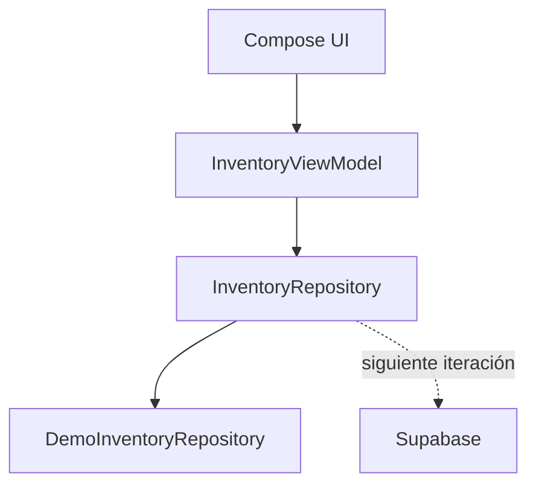

# Stockly 📦

Aplicación móvil de gestión de inventario para pequeños emprendimientos, desarrollada como challenge técnico con **Kotlin Multiplatform + Compose Multiplatform**.

## Qué resuelve

Stockly permite administrar productos y stock desde el celular, registrar entradas/salidas y detectar automáticamente productos con stock bajo o agotado.

### Funciones incluidas
- Dashboard de inventario.
- Listado, búsqueda y filtros de productos.
- Crear, editar y eliminar productos.
- Estados de stock calculados automáticamente.
- Registrar entradas y salidas.
- Prevención de stock negativo.
- Historial de movimientos.
- Categorías.
- Estadísticas simples.
- Datos demo funcionales para poder ejecutar la app sin configuración externa.

## Regla de stock

- `stock == 0` → **Sin stock**
- `stock > 0 && stock <= minimumStock` → **Stock bajo**
- `stock > minimumStock` → **Disponible**

El stock no se edita manualmente una vez creado el producto: cambia mediante movimientos.

## Arquitectura



La UI y la lógica de negocio se comparten en `commonMain`. Hay entry points Android e iOS.

## Ejecutar en Android (Windows)

1. Instalá Android Studio y abrí la carpeta `Stockly`.
2. Si el IDE avisa que falta `gradle-wrapper.jar`, ejecutá una vez `setup-windows.ps1` con PowerShell. El script solo descarga el wrapper oficial de Gradle 8.13.
3. Esperá el Gradle Sync.
4. Elegí un emulador o tu teléfono Android.
5. Ejecutá la configuración `composeApp`.

También podés compilar desde la terminal:

```powershell
.\gradlew.bat :composeApp:assembleDebug
```

APK resultante:

`composeApp/build/outputs/apk/debug/composeApp-debug.apk`

## iOS

El módulo compartido ya incluye targets `iosArm64` e `iosSimulatorArm64` y el entry point `MainViewController`. La carpeta `iosApp/iosApp` contiene la vista SwiftUI. Para generar/ejecutar el proyecto iOS final hace falta macOS + Xcode.

## Supabase

La app corre inmediatamente con un repositorio demo para no bloquear el desarrollo. En `supabase/schema.sql` está preparado el esquema de datos definitivo para la conexión a Supabase. La integración de red puede sustituir `DemoInventoryRepository` sin cambiar las pantallas ni las reglas de negocio.

## IA utilizada

Se utilizó ChatGPT como asistente de desarrollo para:
- definir alcance y reglas de negocio;
- diseñar la arquitectura y el prototipo;
- generar una primera implementación;
- auditar validaciones y consistencia del stock;
- preparar tests, documentación y CI.

Las decisiones funcionales y la validación final del código quedan a cargo del desarrollador.

## Stack

- Kotlin 2.2.20
- Kotlin Multiplatform
- Compose Multiplatform 1.12.1
- Material 3
- Android Gradle Plugin 8.11.1
- Gradle 8.13
- JDK 17+

## Próximos pasos

1. Conectar `InventoryRepository` a Supabase.
2. Persistir fotos de producto en Supabase Storage.
3. Agregar lector de código de barras.
4. Agregar tests del repositorio remoto.
